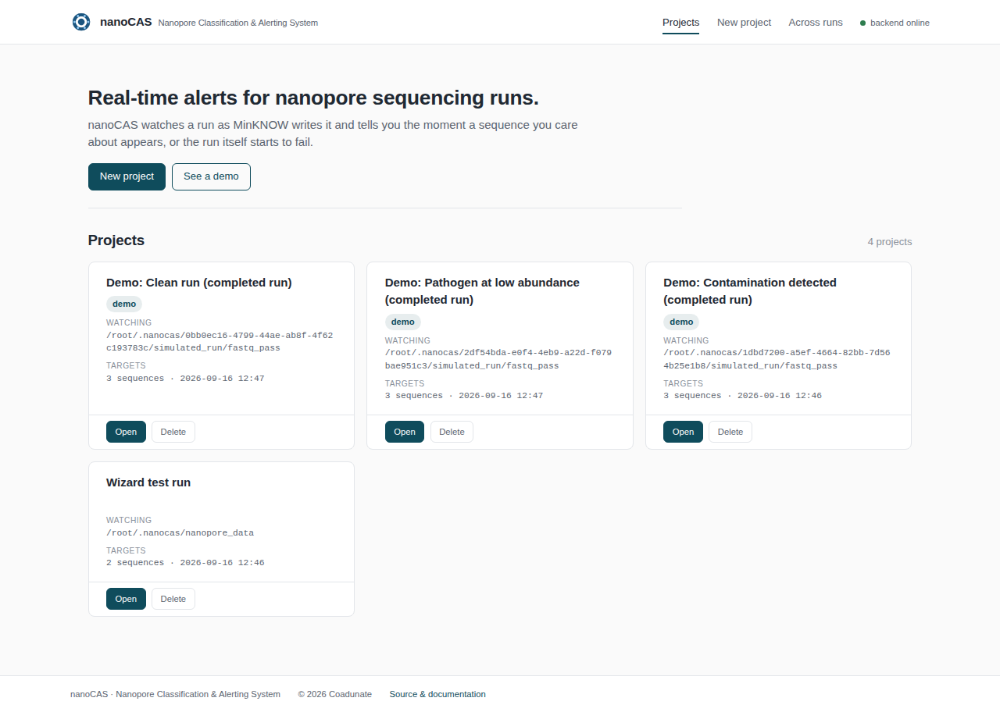
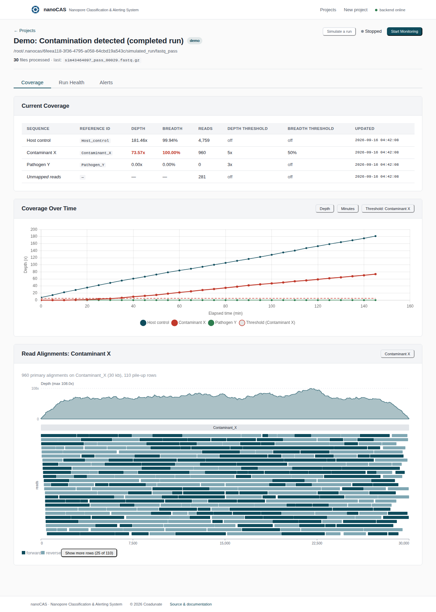
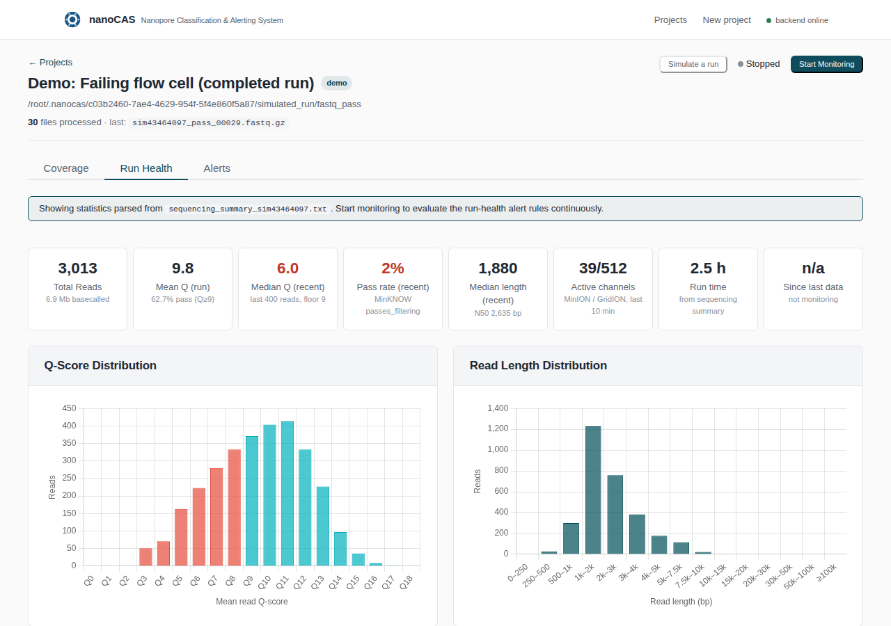
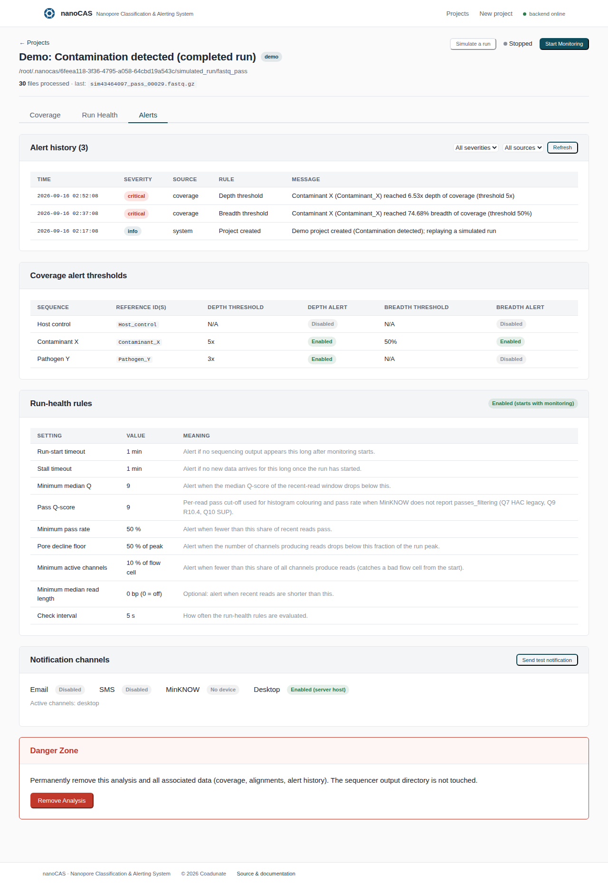
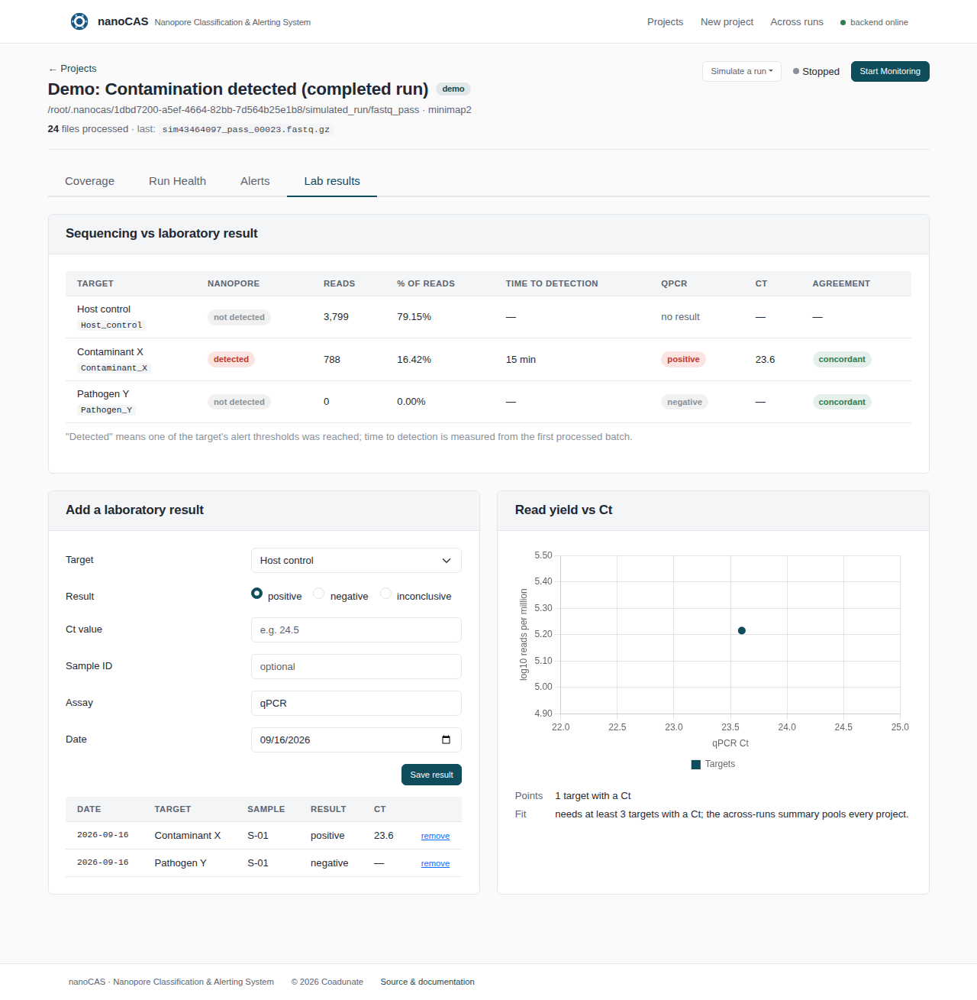
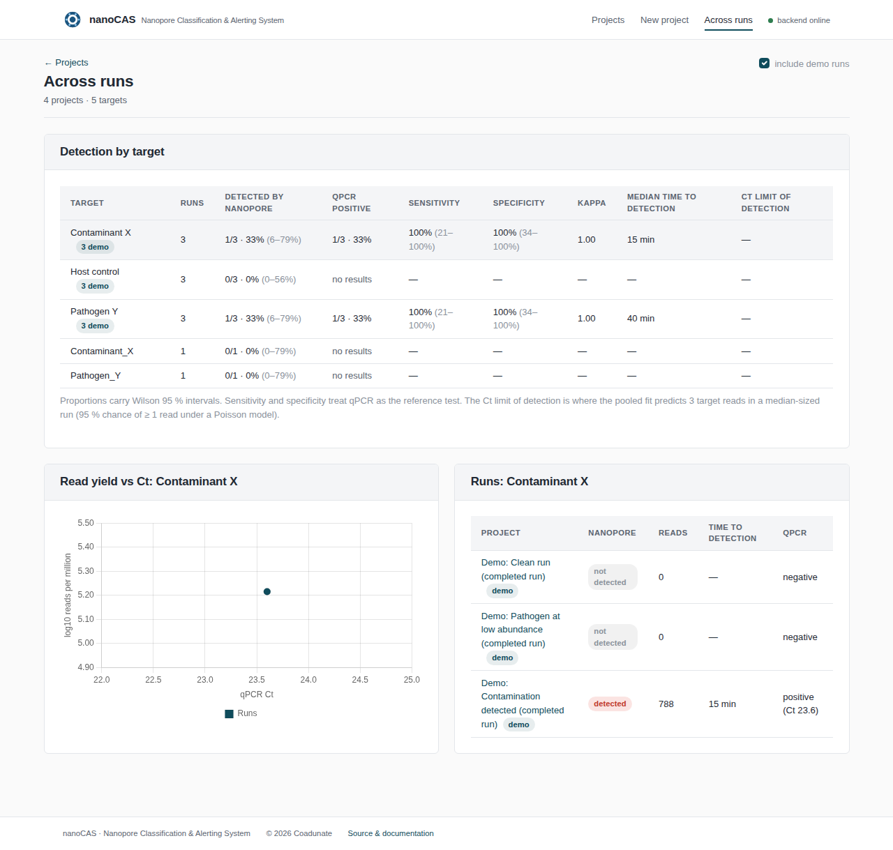
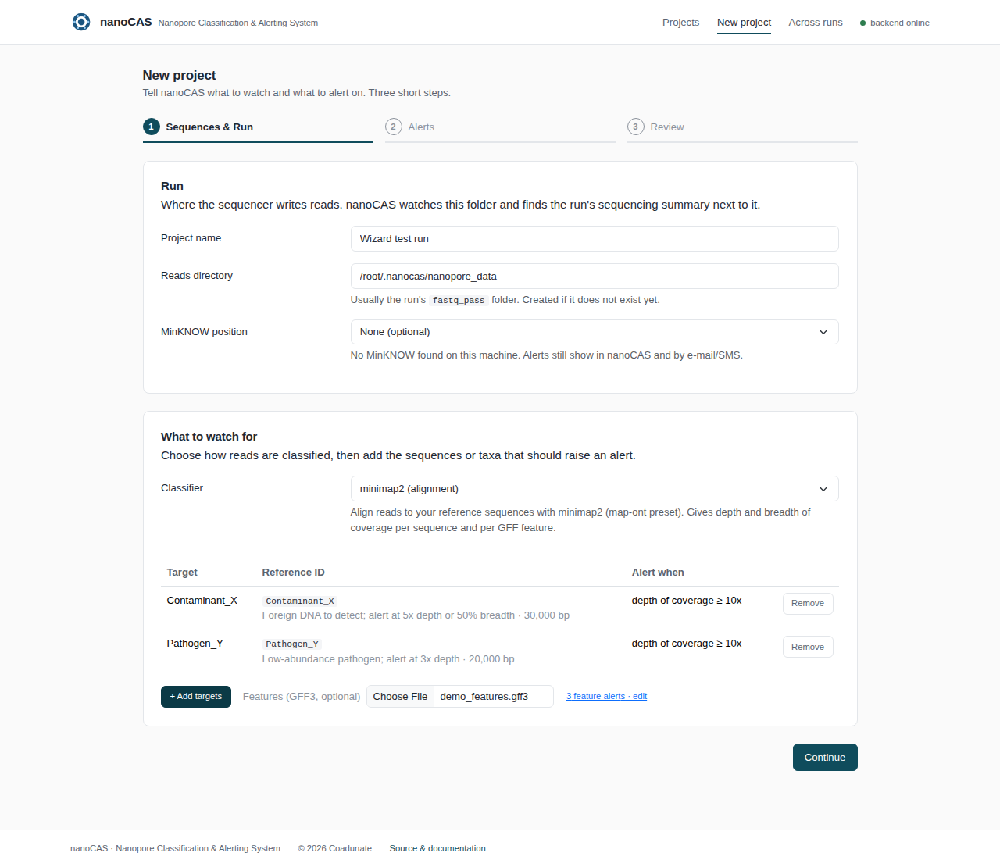
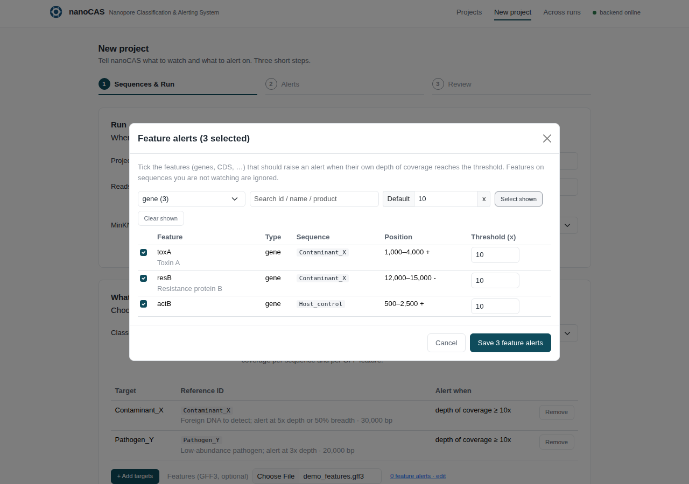

<div align="center">
    
    <h1>nanoCAS</h1>
    <i>Nanopore Classification &amp; Alerting System: real-time contamination detection and run-health alerting for Oxford Nanopore sequencing</i><br>
</div>

# Overview

nanoCAS runs alongside a live Oxford Nanopore sequencing run (MinION, GridION, PromethION, Flongle) and watches the
basecalled output as it is written. Every new FASTQ batch is aligned with **minimap2** against the user's reference
sequences (for example a suspected contaminant, a pathogen, or a positive-control sequence), per-reference depth and
breadth of coverage are updated incrementally, and the operator is alerted the moment a coverage threshold is
reached. In parallel, a **run-health monitor** tails MinKNOW's `sequencing_summary` file and raises instrument-level
alerts: run never started, data production stalled, read quality collapsed, pores dying, low pass rate, or a flow
cell that looks bad from the start.

Alerts are shown in the web UI, written to a per-project alert log, and can be delivered by e-mail, SMS (Twilio),
desktop notification and directly into the MinKNOW UI of the sequencing position.

## Screenshots

| Projects | Coverage (simulated contamination) |
|---|---|
|  |  |

| Run health (simulated failing flow cell) | Alerts |
|---|---|
|  |  |

| Lab results (qPCR vs sequencing) | Across runs |
|---|---|
|  |  |

| New project: targets, classifier, GFF features | GFF feature picker |
|---|---|
|  |  |

All four were captured from demo projects created with **Try it without a sequencer**; no hardware was involved.

## Features

| Area | What nanoCAS does |
|---|---|
| **Live ingestion** | Watches a directory (typically `fastq_pass`) with `watchdog`; handles MinKNOW's atomic-rename writes, `.fastq`, `.fq`, gzipped variants and externally produced BAMs. Files already present are caught up on start; failed batches are recorded and retried on restart, never silently dropped. |
| **Coverage** | Per-batch minimap2 alignment (`-x map-ont`, multi-threaded) folded into a rolling per-position depth accumulator (O(reads in batch), not O(all reads)). Depth counts every aligned base regardless of base quality (matches `samtools depth`); read counts are primary alignments only. |
| **Classifiers** | minimap2 (alignment), Kraken2 and Centrifuge (taxonomic) built in; add your own by dropping a Python class into `~/.nanocas/plugins/`. Alerts are defined on metrics, not tools. |
| **Target alerts** | Depth (x), breadth (%), read count and read fraction thresholds per target; per-feature depth alerts chosen from an uploaded GFF3. Each fires once per run. |
| **Lab results** | Record confirmatory qPCR results (Ct) per target; nanoCAS reports agreement, time to detection and the log10(RPM)–Ct regression; the across-runs page pools every project with Wilson intervals, sensitivity/specificity, Cohen's kappa and a Ct limit of detection. |
| **Run-health alerts** | Seven rules with hysteresis, evaluated every 30 s while monitoring (see [Run-health rules](#run-health-rules)). Flow-cell type (Flongle / MinION / PromethION) is inferred from the channel numbers. |
| **Visualisation** | Coverage-over-time chart with threshold line, current-coverage table, stacked read alignment viewer with GFF regions, Q-score and read-length histograms, median-Q trend, throughput, pore-health and instrument panels. |
| **Alert history** | Every alert (fired and recovered) is appended to `alerts.jsonl` and browsable/filterable in the Alerts tab; live toasts and a banner appear as alerts arrive. |
| **Notifications** | E-mail (STARTTLS or implicit TLS), SMS via Twilio, desktop popups, and MinKNOW user messages; a "send test notification" button verifies the configuration before the run. |
| **Simulation** | A built-in sequencer simulator with six scenarios (clean, contamination, pathogen, failing flow cell, stall, never started) and one-click demo projects with a replayed 3-hour history, so the system can be shown end-to-end without hardware. |
| **Safety** | Path-traversal guards on every project endpoint, sanitised uploads, no shell-string command execution, no secrets in the repository, thread-safe Socket.IO emits (threading async mode). |

## How it works

```
MinKNOW ──writes──▶ fastq_pass/ ──watchdog──▶ FileHandler ──minimap2 | samtools sort──▶ per-batch BAM
                                                    │
                                                    ├─▶ CoverageAccumulator (numpy depth arrays, persisted)
                                                    ├─▶ coverage.csv (one row per reference per batch)
                                                    └─▶ coverage alerts ──▶ AlertLog + Notifier + Socket.IO
MinKNOW ──writes──▶ sequencing_summary.txt ──tail──▶ RunHealthMonitor ──rules──▶ run-health alerts ──▶ same
```

Everything lives under `~/.nanocas/`:

```
~/.nanocas/
├── .cache                         # project index: id<TAB>watched dir<TAB>project dir
├── logs/nanocas.log               # rotating server log
├── nanopore_data/                 # default watched directory for offline use
└── <projectId>/
    ├── alertinfo.cfg              # project configuration (JSON)
    ├── database/<ts>.mmi          # minimap2 index of the selected references
    ├── minimap2/runs/*_sorted.bam # one indexed BAM per processed batch
    ├── coverage_state.npz/.json   # rolling depth accumulator
    ├── coverage.csv               # coverage time series
    ├── merged.bam                 # built lazily for the alignment viewer
    ├── alerts.jsonl               # alert history (fired + recovered)
    ├── sent_alerts.json           # once-per-run de-duplication state
    ├── processed_files.txt        # batches processed
    └── failed_files.json          # batches that failed (retried on restart)
```

## Try it without a sequencer

nanoCAS ships a sequencer simulator so the whole system can be demonstrated on a laptop.

**In the UI:** open http://localhost:3000 and click **Try it without a sequencer**. Pick a scenario and choose
whether to include a completed 3-hour run. The demo project gets three synthetic references (sample DNA, a
contaminant and a pathogen) and a minimap2 index. On the project page, **Simulate a run** starts a background
writer that produces gzipped FASTQ batches and a `sequencing_summary` file exactly the way MinKNOW does (temp file +
atomic rename, one batch every 5 s, run time advancing 60x faster than wall time) and starts monitoring in the same
click. Watch the Coverage, Run Health and Alerts tabs react.

| Scenario | What happens | Alerts you should see |
|---|---|---|
| Clean run | Only sample DNA, stable quality and pores | none |
| Contamination detected | Foreign DNA ramps to ~20 % of reads after a few batches | `breadth`, then `depth` on Contaminant X (about 1–2 min) |
| Pathogen at low abundance | A pathogen at ~3 % of reads | `depth` on Pathogen Y once enough reads accumulate |
| Failing flow cell | Active channels decay 440 → 20, quality drops Q13 → Q6 | `pore_decline`, `low_median_q`, `low_pass_rate`, `low_active_channels` |
| Run stalls | A few batches, then nothing | `data_stalled` after 1 min |
| Run never starts | Nothing is written | `run_not_started` after 1 min |

Demo projects use fast run-health settings (1-minute timeouts, 5-second checks) so alerts arrive within a minute
or two; real projects default to 15/30-minute timeouts.

**From the command line** (server must be installed, not necessarily running):

```bash
cd server
python demo.py seed                       # 3 completed runs + 1 project ready for a live simulation
python demo.py list
python demo.py simulate <projectId> --scenario flowcell_failure --interval 5
python demo.py reset                      # remove all demo projects
```

`simulate` writes into the project's watched directory from a separate process, which is the closest thing to a
real MinKNOW: start the server, press **Start Monitoring** on the project, then run the command. Everything lives
under `~/.nanocas/<projectId>/simulated_run/`; no other directory is touched.

**In tests:** `pytest server/tests/test_simulator.py` and `test_e2e_pipeline.py` exercise the same simulator through
the real pipeline (they skip when minimap2/samtools are absent).

## Installation

### Requirements

- Python 3.10+ (3.12 recommended)
- Node.js 18+ and npm (frontend build)
- `minimap2` and `samtools` on `PATH`
- Optional: MinKNOW on the same host for device selection and in-instrument notifications; a Twilio account for SMS

### Docker (recommended)

```bash
docker compose up --build
# UI: http://localhost:3000   API: http://localhost:5007
```

Mount the sequencer's output directory into the backend container (see the commented volume in
`docker-compose.yml`) using the **same path** MinKNOW uses, so the directory you type into the wizard resolves inside
the container. Copy `env.example` to `.env` to set Twilio credentials, `SECRET_KEY` and ports.

### macOS (next to a MinION)

```bash
brew install python@3.12 node@20 minimap2 samtools git
git clone https://github.com/tayabsoomro/nanoCAS.git && cd nanoCAS
python3.12 -m venv venv && source venv/bin/activate
pip install -r server/requirements.txt
cp env.example server/.env                # set SECRET_KEY and, for SMS, the TWILIO_* values
(cd frontend && npm ci && npm run build)  # one-time UI build
(cd server && python nanocas.py)          # everything on http://localhost:5007
```

For development with hot reload use `./start_nanocas.sh` instead (backend :5007 + CRA dev server :3000).

MinKNOW on macOS writes runs under `/Library/MinKNOW/data/<experiment>/<sample>/<run>/`; point a project at the
run's `fastq_pass` folder. Desktop alerts use Notification Center. To start at login, run the backend under
`launchd` with `gunicorn --worker-class gthread --threads 16 -w 1 --bind 0.0.0.0:5007 nanocas:app` from the
`server/` directory (one worker only) and serve `frontend/build` with any static server. Docker Desktop also
works (`docker compose up --build`) but cannot see MinKNOW on the host.

### Manual

```bash
# backend
cd server
pip install -r requirements.txt
python nanocas.py                 # http://0.0.0.0:5007

# frontend (development server with API proxy to :5007)
cd frontend
npm ci
npm start                         # http://localhost:3000
```

For production, build the UI once (`cd frontend && npm run build`); the backend serves `frontend/build` on its
own port whenever that directory exists, so http://localhost:5007 then delivers the whole application from a
single process with no external requests (Bootstrap and the chart libraries are bundled; nothing is fetched from
a CDN, which matters on an offline instrument laptop). Set `NANOCAS_STATIC_DIR` to another build directory, or
to an empty string to disable. Alternatively serve `frontend/build` with any static server and set
`REACT_APP_API_ENDPOINT` at build time (see `frontend/env.example`), or use `frontend/nginx.conf`. To run the
backend under gunicorn:

```bash
cd server
gunicorn --worker-class gthread --threads 16 -w 1 --bind 0.0.0.0:5007 nanocas:app
```

Use exactly one worker: the file watchers and run-health monitors are in-process state.

`setup.sh` (Docker / conda / bare-metal helper) and `install.py` (cross-platform installer) are also provided.

### Environment variables

| Variable | Purpose |
|---|---|
| `BACKEND_PORT` / `BACKEND_HOST` | Backend bind address (default `0.0.0.0:5007`) |
| `SECRET_KEY` | Persistent Flask secret; a random per-process key is generated when unset |
| `TWILIO_ACCOUNT_SID`, `TWILIO_AUTH_TOKEN`, `TWILIO_PHONE_NUMBER` | Twilio credentials for SMS alerts |
| `NANOCAS_THREADS` | Threads for minimap2 / samtools per batch (default `min(4, cores)`) |
| `NANOCAS_LOG_LEVEL` | `DEBUG`, `INFO` (default), `WARNING` |
| `NANOCAS_STATIC_DIR` | UI build directory to serve from the backend (default `frontend/build` if present; empty disables) |
| `CORS_ALLOWED_ORIGINS` | Restrict browser origins in production (default `*`) |
| `MAX_UPLOAD_MB` | Upload size limit (default 2048) |
| `REACT_APP_API_ENDPOINT` | (frontend) backend URL when served from another origin |

## Usage

1. **Create a project** (`New Project`):
   - *Sequences & location*: give the project a name, enter the MinKNOW output directory to watch (usually the
     run's `fastq_pass` folder; it is created if missing so you can prepare before starting the run), optionally
     select a MinKNOW position, upload one or more reference FASTA files and pick the sequences to monitor with
     their depth / breadth thresholds. Optionally upload a GFF of regions of interest.
   - *Alerts & notifications*: enable e-mail and/or SMS (with a test button), and review the run-health rule
     thresholds.
   - *Summary*: create the project. The minimap2 index is built in the background with live progress.
2. **Open the project** and press **Start Monitoring**. Existing files are processed first, then new batches as
   MinKNOW writes them. The run-health monitor starts at the same time.
3. Watch the **Coverage**, **Run Health** and **Alerts** tabs. Alerts also arrive as toasts, by e-mail/SMS and in
   MinKNOW if configured.
4. **Stop Monitoring** at any time; restarting never reprocesses a batch twice.

### Run-health rules

All thresholds are configurable per project in the wizard (stored as `runHealthConfig` in `alertinfo.cfg`).
A rule fires after its condition has held for `consecutiveChecks` evaluations (default 2 × 30 s) and logs a
*recovered* entry when it clears, after which it can fire again.

| Rule | Fires when | Default |
|---|---|---|
| `run_not_started` | No data file and no summary rows have appeared since monitoring started (suppressed while MinKNOW reports `PROCESSING`) | 15 min |
| `data_stalled` | No new data file / summary rows for the stall timeout after data was seen | 30 min |
| `low_median_q` | Median mean-Q of the last *N* reads below the floor | Q 9, N = 2000 |
| `pore_decline` | Channels producing reads in the last 10 min of run time fall below a fraction of the run's peak | 50 % of peak |
| `low_active_channels` | Recently active channels below a fraction of the flow cell's channel count | 10 % |
| `low_pass_rate` | Pass fraction of the recent window below the floor (MinKNOW `passes_filtering`, or Q ≥ pass threshold when absent) | 50 % |
| `short_reads` | Median read length of the recent window below the floor (opt-in) | off |

Flow-cell geometry is inferred from the highest channel number in the summary (≤126 Flongle, ≤512 MinION/GridION,
≤3000 PromethION). When a MinKNOW position is selected, its live acquisition status, flow-cell id and channel count
are shown in the Run Health tab and used by the run-start rule.

### Classifiers and plug-ins

A project's reads are processed by a *classifier*. Built in:

| Name | Kind | Reference | Metrics |
|---|---|---|---|
| `minimap2` | alignment | uploaded FASTA (choose records) | depth, breadth, reads, fraction, GFF features |
| `kraken2` | taxonomic | Kraken2 database directory on the server | reads, fraction (clade counts) |
| `centrifuge` | taxonomic | Centrifuge index prefix on the server | reads, fraction |

Targets for taxonomic classifiers are taxon names as they appear in the tool's report, or NCBI taxids.

To add your own, create `~/.nanocas/plugins/<anything>.py`:

```python
from app.main.utils.classifiers import Classifier, BatchResult

class BlastClassifier(Classifier):
    name = 'blastn'                 # used in project configuration
    label = 'BLAST (alignment-free counts)'
    kind = 'taxonomic'              # 'alignment' -> return bam_path; 'taxonomic' -> return read_counts
    reference_input = 'database'    # or 'fasta'
    executables = ('blastn',)       # checked on PATH for availability

    def build_index(self, references, headers, output_dir, progress=None):
        return references[0]        # validate / build; return what classify() needs

    def classify(self, input_path, index_path, workdir, *, threads=4):
        counts = run_blast_and_count(input_path, index_path)   # {target: reads}
        return BatchResult(read_counts=counts, total_reads=..., unclassified=...)
```

It appears in the wizard's classifier list at the next server start (`GET /classifiers`). A file that fails to
import is logged and skipped; a plug-in cannot override a built-in name.

### GFF feature alerts

Upload a GFF3 in the wizard, tick the features (genes, CDS, …) to alert on and set a depth threshold per feature.
Selected features are stored as `regions.json` and can be toggled or re-thresholded later in the Alerts tab; the
watcher reloads the file before every batch. Feature alerts need an alignment classifier.

### Lab results and statistics

The **Lab results** tab records confirmatory qPCR results per target (result, Ct, sample id, assay, date) and shows,
per target, what the run found (reads, share of reads, time to detection) next to the laboratory call, with
concordant/discordant flags and a log10(reads per million) versus Ct regression (Pearson r, p from a two-sided
t-test, slope; -0.30 per cycle is the expectation at 100 % PCR efficiency).

The **Across runs** page pools every project: positivity by nanopore and by qPCR with Wilson 95 % intervals,
sensitivity, specificity and Cohen's kappa against qPCR, median time to detection, the pooled RPM–Ct fit and the
Ct at which the fit predicts 3 target reads in a median-sized run (95 % detection under a Poisson model). Demo
runs are labelled and can be excluded. `docs/LANDSCAPE.md` places all of this against MinKNOW, EPI2ME, RAMPART,
minoTour, MARTi, CZ ID and the other tools in the field.

### Coverage definitions

- **Depth** = (sum of aligned bases over all positions) / reference length, counting every base of every primary,
  supplementary-free alignment irrespective of base quality (equivalent to `samtools depth` with `-q 0`).
- **Breadth** = percentage of reference positions with depth ≥ 1.
- **Reads** = primary alignments to the reference (secondary and supplementary records are not counted).
- **Unmapped** = reads with no alignment to any selected reference.

## API

All endpoints are JSON. Project-scoped endpoints take `projectId` and reject anything that is not a valid
project id.

| Route | Purpose |
|---|---|
| `GET /health`, `GET /version` | Liveness, tool availability (`minimap2`, `samtools`), Twilio state |
| `GET /get_all_analyses`, `GET /get_analysis_info?uid=`, `POST /delete_analyses` | Project registry (passwords are redacted) |
| `POST /get_uid`, `POST /validate_locations` | Project creation helpers |
| `POST /upload_fasta`, `POST /upload_gff`, `POST /upload_reference`, `POST /parse_fasta_headers` | Uploads; header parser returns id, description and length per record |
| `GET /get_coverage`, `GET /get_coverage_summary` | Coverage time series / latest values with thresholds |
| `GET /get_alignments?reference=` | Primary alignments + GFF regions for the viewer (lazy merged BAM) |
| `GET /run_health`, `GET /run_health_defaults` | Run-health snapshot (live monitor state or one-shot parse) and rule defaults |
| `GET /get_alerts` | Alert history, active rules, enabled channels |
| `GET /classifiers` | Built-in and plug-in classifiers with availability |
| `POST /parse_gff`, `GET /get_regions`, `POST /update_regions` | GFF feature alerts |
| `GET/POST/DELETE /lab_results`, `GET /lab_correlation`, `GET /cohort` | Laboratory results and statistics |
| `POST /test_notification` | Send a test through every configured channel |
| `GET /get_processing_status` | Files processed / failed, monitoring state |
| `GET /index_devices` | MinKNOW positions (read-only) |
| `POST /demo/create`, `GET /simulation/scenarios` | Demo project creation (optionally with replayed history) and scenario list |
| `POST /simulation/start`, `POST /simulation/stop`, `GET /simulation/status`, `POST /simulation/reset` | Simulated sequencer control (start also begins monitoring) |

Socket.IO events: `start_fastq_file_listener`, `stop_fastq_file_listener`, `check_fastq_file_listener`,
`download_database` (+ `download_database_status` / `download_database_complete`), `remove_analysis`,
`test_notification`; server pushes `coverage_update`, `file_progress_update`, `run_health_update`, `alert_fired`.

## Development

```
nanoCAS/
├── frontend/                       # React 17 + TypeScript (Create React App)
│   └── src/
│       ├── api.ts                  # axios client, shared types, run-health field metadata
│       ├── modules/project/        # project list, detail page, Coverage / Run Health / Alerts tabs
│       ├── modules/setup/          # 3-step project wizard
│       └── modules/analysis/       # SVG read-alignment viewer
├── server/
│   ├── nanocas.py                  # entry point (logging + socketio.run)
│   ├── demo.py                     # demo / simulation CLI
│   ├── app/__init__.py             # Flask app factory, Socket.IO (threading mode)
│   ├── app/main/routes.py          # HTTP API
│   ├── app/main/events.py          # Socket.IO handlers + listener registry
│   ├── app/main/utils/
│   │   ├── FileHandler.py          # watchdog handler: align, accumulate, alert
│   │   ├── coverage_accumulator.py # rolling per-position depth
│   │   ├── run_health.py           # summary tailer, rules engine, monitor thread
│   │   ├── alerts.py               # AlertLog, Notifier, safe socket emits
│   │   ├── project_store.py        # project index + id validation
│   │   ├── simulator.py            # sequencer simulator, scenarios, demo projects
│   │   ├── classifiers/            # Classifier contract, minimap2 / kraken2 / centrifuge, plug-in registry
│   │   ├── gff.py                  # GFF3 features -> alert regions
│   │   ├── lab_results.py, stats.py # qPCR results, correlation, cohort statistics
│   │   ├── tasks.py                # minimap2 index build
│   │   ├── LinuxNotification.py    # MinKNOW gRPC (positions, messages, live status)
│   │   ├── email.py / sms.py       # SMTP / Twilio
│   │   └── directory_scanner.py    # output-directory inventory
│   └── tests/                      # pytest suite (unit, API, end-to-end with minimap2/samtools)
├── docker-compose.yml, server/Dockerfile, frontend/Dockerfile
└── .github/workflows/ci.yml       # pytest (3.10, 3.12) + tsc + CI build
```

### Tests

```bash
pip install -r server/requirements.txt -r server/requirements-dev.txt
pytest server/tests -q            # end-to-end tests skip themselves if minimap2/samtools are missing
cd frontend && npx tsc --noEmit && CI=true npm run build
```

The suite redirects `~/.nanocas` to a temporary directory, so it never touches real projects.

## Troubleshooting

- **"Start Monitoring" is disabled**: the reference index has not been built. Check `database/building_index.txt`
  in the project directory and that `minimap2` is installed (`GET /health`).
- **Files are not picked up**: verify the watched path is the directory MinKNOW writes FASTQ files to (not the run
  root) and that the backend can read it. Failed batches are listed by `GET /get_processing_status` and in the
  project header.
- **No run-health data**: MinKNOW writes `sequencing_summary_*.txt` into the run directory once basecalling starts;
  nanoCAS searches the watched directory, its parent and the project directory (depth 3).
- **Notifications don't arrive**: use *Send test notification* in the wizard or the Alerts tab; each channel reports
  its own error. For Gmail use an app password; port 465 uses implicit TLS, 587 STARTTLS. SMS requires Twilio
  credentials in the backend `.env`.
- **Logs**: `~/.nanocas/logs/nanocas.log` (rotating) and stdout.

## Citation

If you use nanoCAS in your research, please cite:

```
Soomro T, Horovatin S, Dumonceaux TJ, Links MG. (2025) nanoCAS: A real-time monitoring tool for Nanopore sequencing data. Manuscript in preparation for BMC Bioinformatics.
```

## License

CC-BY

## Acknowledgments

- The nanoCAS development team (Tayab Soomro & Sam Horovatin)
- Dr. Tim Dumonceaux from AAFC for guidance and support
- The open-source community for the libraries and tools used in this project
